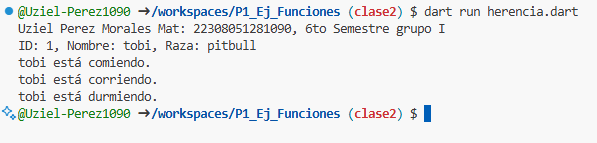

crear una clase animal con 2 atributos (id animal, nombre y raza) y una función comer(). crear otra clase perro con herencia animal con  las funciones correr() y otra dormir(). lenguaje Dart

salida de resultados.
